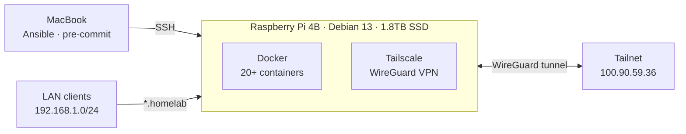

# Raspberry Pi Homelab

Production-grade home infrastructure on Raspberry Pi 4B (1.8TB SSD), managed with Ansible and Docker.

## Infrastructure



**LAN access:** AdGuard resolves `*.homelab` → Pi IP → Traefik routes by Host header.

**Remote access:** Tailscale split DNS resolves `*.homelab` → Tailscale IP → same Traefik routing.

## Services

| Service          | Port          | Domain              | Description                       |
| ---------------- | ------------- | ------------------- | --------------------------------- |
| **Traefik**      | 80, 443, 8180 | traefik.homelab     | Reverse proxy for all services    |
| **AdGuard Home** | 53, 8080      | adguard.homelab     | DNS + ad blocking + local domains |
| **Tailscale**    | 41641/udp     | —                   | VPN mesh + subnet router          |
| **Jellyfin**     | 8096          | jellyfin.homelab    | Media server (direct play only)   |
| **Sonarr**       | 8989          | sonarr.homelab      | TV series automation              |
| **Radarr**       | 7878          | radarr.homelab      | Movie automation                  |
| **Prowlarr**     | 9696          | prowlarr.homelab    | Indexer management                |
| **qBittorrent**  | 8181          | qbittorrent.homelab | Torrent client                    |
| **Portainer**    | 9000, 9443    | portainer.homelab   | Container management              |
| **Homepage**     | 3001          | homepage.homelab    | Dashboard                         |
| **Glances**      | 61208         | glances.homelab     | System monitoring                 |
| **FileBrowser**  | 8082          | filebrowser.homelab | File manager                      |
| **Control API**  | 9099          | control.homelab     | Shutdown/restart/update           |
| **Maintainerr**  | 6246          | maintainerr.homelab | Auto-delete watched media         |
| **Jellyseerr**   | 5055          | jellyseerr.homelab  | Netflix-style media requests      |
| **Watchtower**   | —             | —                   | Auto-update containers            |

## Quick Start

```bash
# Clone and setup
git clone https://github.com/aemreusta/pi-homelab && cd pi-homelab
pre-commit install && pre-commit install --hook-type commit-msg
make requirements

# Base provisioning
make ping          # test connectivity
make check         # dry-run (no changes)
make base          # full provisioning: common → security → storage → docker

# Deploy services (recommended order)
make tailscale     # VPN — host-level, do this first
make adguard       # DNS
make traefik       # reverse proxy
make media         # Jellyfin, Sonarr, Radarr, Prowlarr, qBittorrent
make portainer     # container management
make homepage      # dashboard
```

Run `make help` to see all available targets.

## Documentation

| Document                                 | Description                                                                              |
| ---------------------------------------- | ---------------------------------------------------------------------------------------- |
| [Architecture](docs/architecture.md)     | Mermaid diagrams: infra, services, network, storage, firewall, inter-service connections |
| [Traefik](docs/traefik.md)               | Reverse proxy setup, routing rules, adding services                                      |
| [Tailscale](docs/tailscale.md)           | VPN setup, subnet routing, split DNS, admin console                                      |
| [Media Stack](docs/media-stack.md)       | Hardlink model, volume mapping, playback strategy                                        |
| [Boot & Recovery](docs/boot-recovery.md) | Boot sequence, failure scenarios, DNS fallback                                           |
| [Project Index](PROJECT_INDEX.md)        | Role overview, file structure, key constraints                                           |

## Commit Convention

[Conventional Commits](https://www.conventionalcommits.org/) enforced via pre-commit hook.

Allowed prefixes: `feat`, `fix`, `docs`, `style`, `refactor`, `perf`, `test`, `build`, `ci`, `chore`, `revert`.
