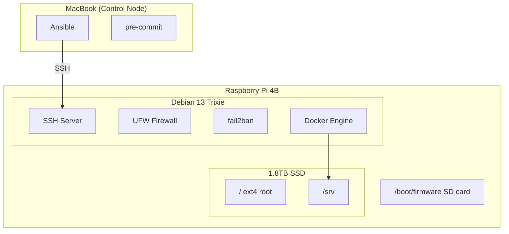
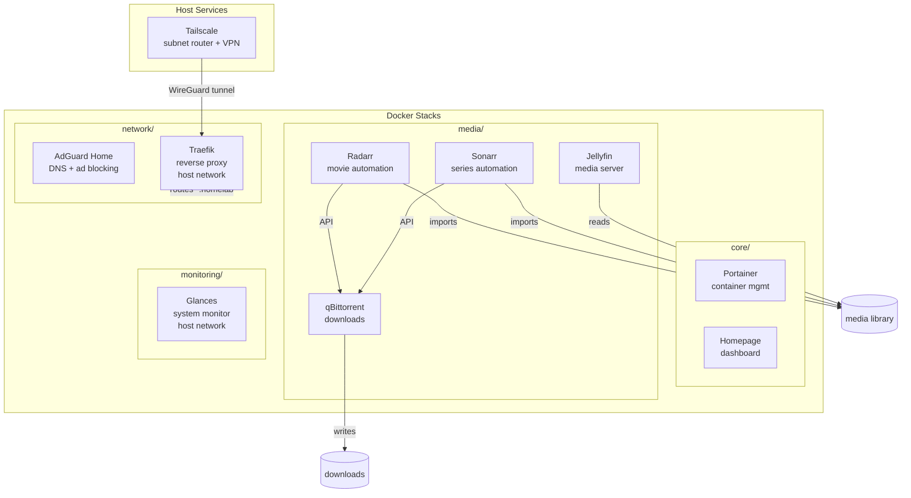
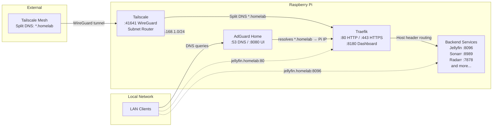
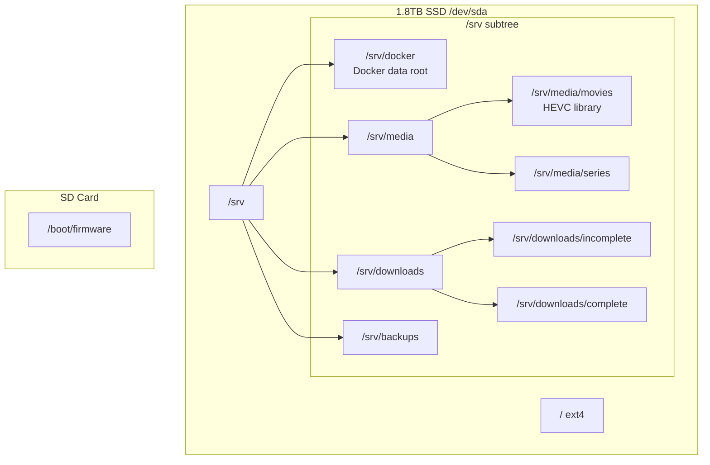
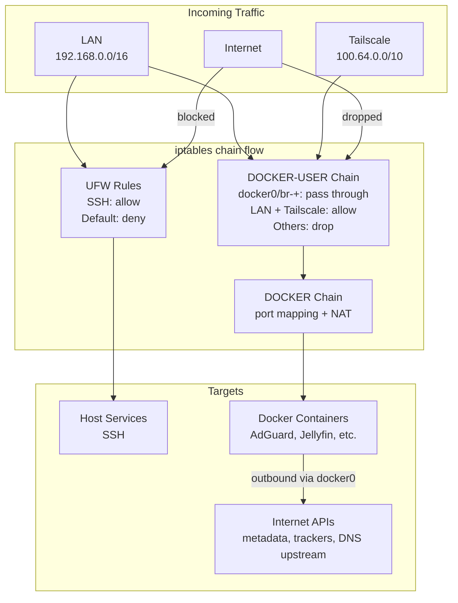
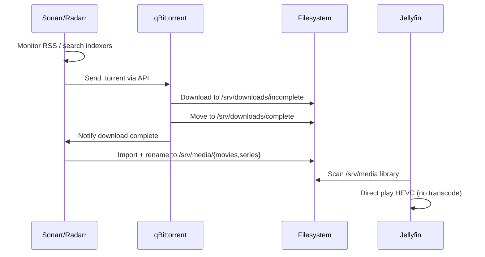
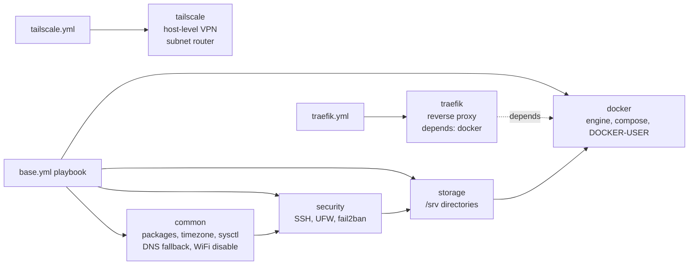

# Architecture

## Infrastructure Topology



## Service Architecture



## Network Architecture



## Storage Layout



## Service Dependency Map

```mermaid
graph TD
    AG[AdGuard Home] -->|DNS resolution| ALL[All containers]
    TF[Traefik] -->|reverse proxy| ALL
    TS[Tailscale] -->|VPN tunnel| TF
    PORT[Portainer] -->|manages| DOCKER[Docker Engine]
    SON[Sonarr] -->|sends downloads| QB[qBittorrent]
    RAD[Radarr] -->|sends downloads| QB
    SON -->|imports to| MEDIA[/srv/media]
    RAD -->|imports to| MEDIA
    JF[Jellyfin] -->|reads| MEDIA
    QB -->|writes| DL[/srv/downloads]
    HP[Homepage] -->|health checks| AG
    HP -->|health checks| PORT
    HP -->|health checks| JF
    HP -->|health checks| SON
    HP -->|health checks| RAD
    HP -->|health checks| QB
    HP -->|health checks| TF
    GL[Glances] -->|monitors| DOCKER

    style AG fill:#4a9eff
    style TF fill:#9b59b6
    style HP fill:#f5a623
```

**Deploy order** (respects dependencies):
1. Tailscale — VPN foundation (host-level, not Docker)
2. AdGuard Home — DNS foundation, everything resolves through it
3. Traefik — reverse proxy, routes `*.homelab` to backend services
4. Portainer — container visibility before deploying more stacks
5. qBittorrent — download engine (no deps)
6. Sonarr / Radarr — depend on qBittorrent API
7. Jellyfin — depends on media library populated by Sonarr/Radarr
8. Homepage — dashboard, deployed last so all services exist
9. Glances — monitoring, independent but more useful with services running

## Firewall Architecture



## Data Flow: Media Stack



## Ansible Role Dependency


